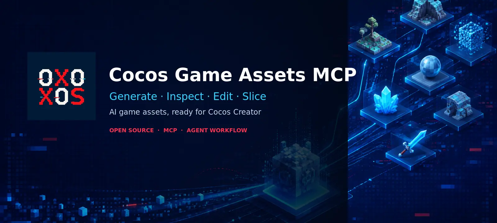
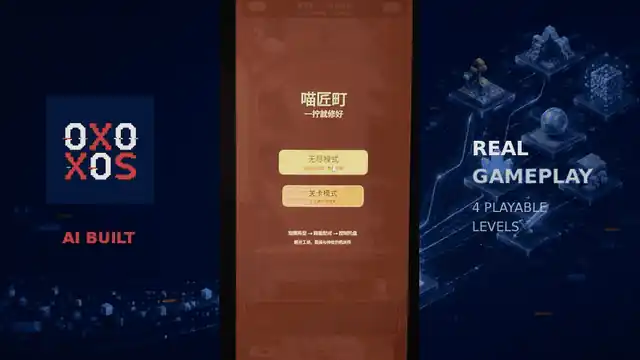
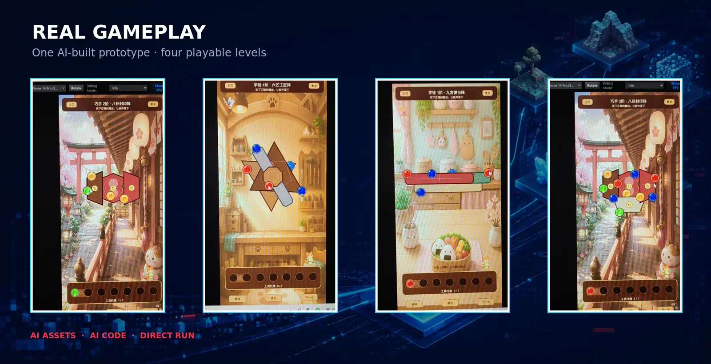
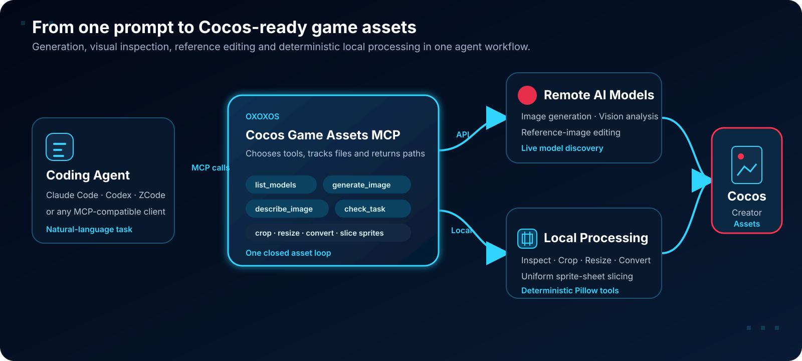

<p align="center">
  
</p>

<h1 align="center" id="top">OXOXOS Cocos Game Assets MCP</h1>

<p align="center">
  <strong>Give coding agents a complete Cocos-ready asset workflow: generate, inspect, edit, normalize, slice and save.</strong>
</p>

<p align="center">
  <a href="README.md">简体中文</a> · <a href="README.en.md"><strong>English</strong></a>
</p>

<p align="center">
  
  
  
</p>

> [!NOTE]
> Independent community project, not affiliated with or endorsed by Cocos. “Cocos” and “Cocos Creator” are trademarks of their respective owners.

## See it in action

<p align="center">
  
</p>

This is a cropped and compressed real recording: AI generated the visual assets, a coding agent wrote the game code, and the result ran directly in Cocos Creator. This MCP powers the **asset generation, visual understanding, reference editing and local image-processing** parts of that workflow.

<p align="center">
  
</p>

## What it solves

A coding agent building a game needs more than one generated image. It must discover current models, inspect outputs, edit from a reference, normalize dimensions, split sprite sheets and place files into the game project.

This project exposes that loop as MCP tools for Claude Code, Codex, ZCode and other MCP clients. Generation and vision are powered by the [OXOXOS API](https://api.oxoxos.com).

- **Live model discovery** — queries the OXOXOS model marketplace at runtime; model ids are not hardcoded.
- **Image generation and editing** — uses an OpenAI-compatible image endpoint with local reference-image support.
- **Vision analysis** — gives non-visual agents “eyes” and supports generated-asset review.
- **Local asset processing** — inspect, crop, resize, convert and split sprite sheets.
- **Concurrent local tasks** — `wait=false` allows multiple generation jobs to run in parallel.
- **Agent-guided installation** — detects clients, backs up configuration, stores the token and verifies the setup.

<p align="center">
  
</p>

## AI auto-install

Give the prompt below to your AI. Installation, client detection, configuration backups, token onboarding and verification rules already live in the repository.

```text
Please install and configure this project:
https://github.com/uskyu/oxoxos-cocos-game-assets-mcp

Read AGENTS.md and the installation Skill first, then complete setup and initialization autonomously.
```

> [!TIP]
> The agent shows a plan and waits for approval before changing configuration. Once approved, it completes configuration and verification without asking you to edit JSON, TOML or `.env` files manually.

### Initialize the OXOXOS API

After installation, tell the agent:

> **“Initialize OXOXOS API configuration.”**

The agent will:

1. Check only whether a token exists, without reading or echoing its value.
2. If missing, guide you to register at [OXOXOS](https://api.oxoxos.com) and create a token in [Token Management](https://api.oxoxos.com/console/token).
3. Store the token outside the repository in a per-user credential file or the client's secure storage.
4. Start the MCP server, enumerate tools and call `list_models` to verify connectivity.
5. Report the configuration scope, verification result and rollback point.

## MCP tools

| Tool | Purpose |
|---|---|
| `list_models` | Current marketplace models and inferred capability hints |
| `generate_image` | Generate or edit images; local background tasks supported |
| `check_task` | Read task status: `running` / `done` / `error` |
| `describe_image` | Analyze a local image and return text |
| `get_image_info` | Read format, dimensions, color mode and file size |
| `crop_image` | Crop by `[left, top, right, bottom]` |
| `resize_image` | Stretch, contain or cover resize |
| `convert_image` | Convert PNG, JPEG, WebP, BMP and GIF |
| `slice_sprite_sheet` | Split a uniform sprite sheet into PNG frames |

Resource `assets://list` lists files in the default local asset directory.

## Supported clients

The bundled installation Skill backs up existing configuration before setting up:

- Claude Code
- OpenAI Codex
- ZCode (bundled `.zcode-plugin/plugin.json`)
- Generic MCP clients (`.mcp.json`)

### Environment variables

| Variable | Purpose | Default |
|---|---|---|
| `OXOXOS_BASE_URL` | OpenAI-compatible API base URL | `https://api.oxoxos.com/v1` |
| `OXOXOS_API_KEY` | Access token | required |
| `OXOXOS_IMAGE_MODEL` | Optional image-model override | dynamic |
| `OXOXOS_VISION_MODEL` | Optional vision-model override | dynamic |
| `OXOXOS_PROXY` | Optional HTTP proxy | empty |
| `OXOXOS_BRAND_NAME` | Brand name for forks | `OXOXOS` |
| `OXOXOS_PORTAL_URL` | Registration / login portal | `https://api.oxoxos.com` |
| `OXOXOS_TOKEN_URL` | Token-management URL | `https://api.oxoxos.com/console/token` |

> [!NOTE]
> Deprecated `QWAPI_*` variables remain compatible for one migration cycle only.

## Dynamic models

The marketplace changes over time. For a reproducible production workflow:

1. Call `list_models(force_refresh=true)`.
2. Confirm the required capability against the current model documentation.
3. Pass the model id explicitly to `generate_image` or `describe_image`.

If `model` is empty, the MCP picks the first inferred candidate. Capability hints come from model metadata and are not permanent guarantees.

## Manual installation

Auto-install is usually enough. For manual setup, see [`docs/installation.md`](docs/installation.md):

- [Claude Code](docs/clients/claude-code.md)
- [OpenAI Codex](docs/clients/codex.md)
- [ZCode](docs/clients/zcode.md)
- [Generic MCP clients](docs/clients/generic.md)

## Update and uninstall

**Update:** ask the agent to run:

```bash
python .agents/skills/install-oxoxos-cocos-game-assets-mcp/scripts/update.py --plan
```

The updater refuses to overwrite uncommitted work, creates a local backup tag, pulls with `--ff-only`, runs `uv sync` and leaves credentials outside the repository untouched.

**Uninstall:** remove the `oxoxos-cocos-game-assets` service entry from the client configuration, restore the backup and optionally delete the per-user credential file.

## Development

```bash
uv sync --group dev
uv run pytest
uv run ruff check .
python .agents/skills/install-oxoxos-cocos-game-assets-mcp/scripts/doctor.py --json
```

> [!WARNING]
> Automated tests never call paid endpoints. `mcp/test_api.py` and `mcp/test_mcp.py` are manual integration probes that may consume API credit; review them before running.

## Contributing and security

- Pull requests are welcome; read [`CONTRIBUTING.md`](CONTRIBUTING.md) first.
- Core code lives in `src/oxoxos_cocos_game_assets_mcp/`.
- Do not rename existing MCP tools or change their JSON success / error shapes.
- Never publish a token in public issues, shared chats, logs, source code or Git.
- Report vulnerabilities privately; see [`SECURITY.md`](SECURITY.md).

## License

Apache-2.0. See [`LICENSE`](LICENSE).

[Back to top](#top)
